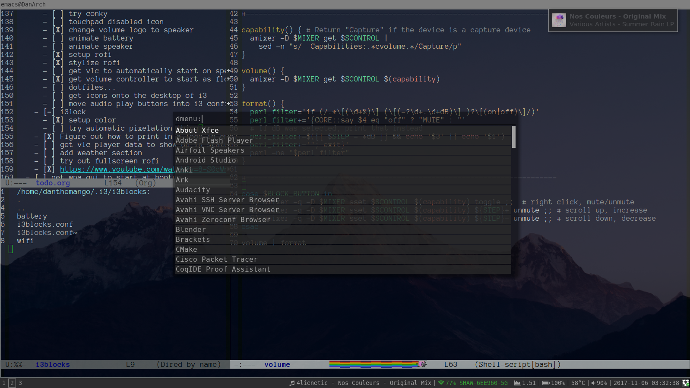

# dotfiles

This project will serve as a *hopefully* simple set up script to get new systems going, and to
keep old systems up to date.

## Result


## Usage
```bash
% make help

WARNING: This will clober your current dotfiles!
Use 'make setup-all' to get things going
Use 'make install-all' to check dependencies
Use 'make configure-all' to set up the dotfiles!
Use 'make configure-shell' to set up server defaults
Use 'make configure-desktop' to set up X windows stuff
Use 'make diff-all' to see what kind of changes will be happening!
Use 'make backup-all' to create a dofile-backup folder and save your current configuration!
Use 'make backup-restore' to replace your current configuration with the files in ~/dotfile-backup/
Use 'make pull-all' to update this repository after trying out new changes
```

## Dependencies
- background image sampled from '~/.fehbg.jpg'
- these dotfiles are used to stylize vim, emacs, tmux, i3 (with i3bars and rofi)
- font needs to be set in urxvt/Xresources (under "Urxvt\*font:")
   - I install .ttf fonts in ~/.fonts
   - I'm using [Anonymous Pro](http://www.marksimonson.com/fonts/view/anonymous-pro)
- I'm using [font-awesome fonts](https://github.com/FortAwesome/Font-Awesome/releases) for the logos in the i3bars
- I'm using [xcwd](https://github.com/schischi/xcwd) to stay in current directory after Mod+Enter (optional)

# Who created this?
The vast majority of this code was taken from [O. Jourmel](https://github.com/ojourmel) in 
[dotfiles repository](https://github.com/ojourmel/dotfiles), (much of which was copied from other great dotfiles) while the Xresources file came from [smjn's config repository](https://github.com/smjn/config)

- Other cool config lines described in [this reddit post](https://www.reddit.com/r/i3wm/comments/3tdpkf/how_i_do_i3_a_how_to_of_sorts_my_config_included/), which has probably has the most extensive i3 config I've seen yet (though I don't like most of the keybinds).

